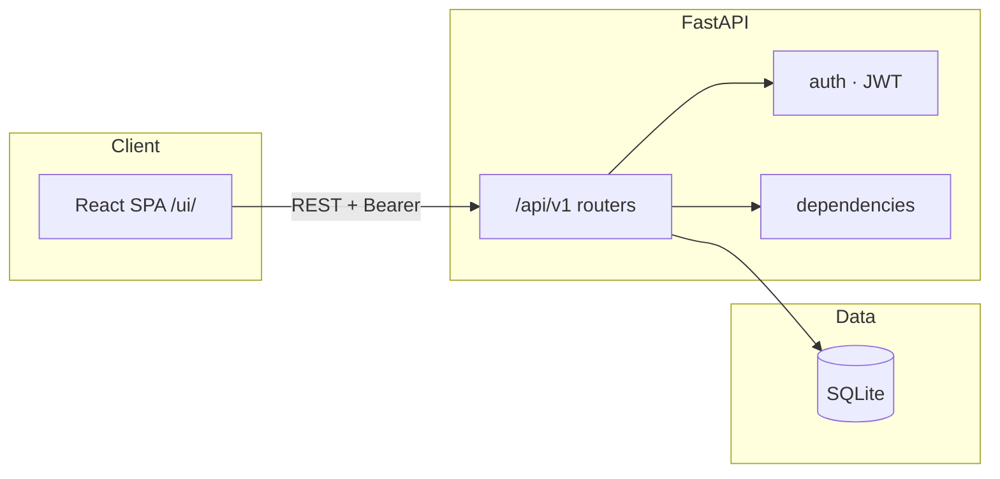

<div align="center">

# Movie Library

**Каталог фильмов с REST API и веб-интерфейсом в стиле Netflix**

[Быстрый старт](#quick-start) · [API](#api-summary) · [Тесты](#tests) · [English](#english)

<br>

[](https://www.python.org/)
[](https://fastapi.tiangolo.com/)
[](https://react.dev/)
[](https://www.sqlite.org/)
[](https://pytest.org/)

[](http://127.0.0.1:8000/docs)
[](http://127.0.0.1:8000/ui/)
[](https://jwt.io/)

</div>

---

<a id="readme-russian"></a>

> **RU** · Полная документация на русском. [Перейти к English](#english)

## Оглавление

| | |
|---|---|
| [Функционал](#features) | [Быстрый старт](#quick-start) |
| [Технологии](#tech-stack) | [Запуск](#run) |
| [API](#api-summary) | [Конфигурация](#configuration) |
| [Архитектура](#architecture) | [Структура проекта](#project-structure) |
| [Безопасность](#changelog-security) | [Тесты](#tests) |

---

<a id="features"></a>

## Функционал

| Backend | Frontend |
|---------|----------|
| Регистрация и вход, **JWT**, профиль `/users/me` | Тёмная тема, карточки фильмов, модальные окна |
| CRUD: фильмы, жанры, режиссёры, избранное | Избранное в один клик |
| Роли: пользователь и **суперпользователь** | Управление каталогом — только для superuser |
| **Swagger** / **ReDoc**, rate limit на login | SPA на React 18 (CDN) + Bootstrap 5 |

---

<a id="tech-stack"></a>

## Технологии

```
┌─────────────────────────────────────────────────────────────┐
│  Browser  →  /ui/ (React SPA)  →  /api/v1/*  (FastAPI)      │
│                              ↓                              │
│                    SQLAlchemy 2  +  SQLite                  │
└─────────────────────────────────────────────────────────────┘
```

| Слой | Технологии |
|------|------------|
| **API** | FastAPI · Pydantic v2 · python-jose · Passlib (bcrypt) · uvicorn |
| **Данные** | SQLAlchemy 2 · SQLite (по умолчанию) · Alembic |
| **Клиент** | React 18 · Bootstrap 5 · Babel (JSX в браузере) |
| **Качество** | pytest · httpx · TestClient |

---

<a id="api-summary"></a>

## API (кратко)

Базовый префикс: **`/api/v1`**

| | Метод | Путь | Описание |
|---|--------|------|----------|
| 🔓 | `POST` | `/auth/register` | Регистрация |
| 🔓 | `POST` | `/auth/login` | JWT (OAuth2 form) |
| 🔒 | `GET` | `/users/me` | Текущий пользователь |
| ○ | `GET` | `/movies/` | Список фильмов |
| ★ | `POST` | `/movies/` | Создать фильм (superuser) |
| ○ | `GET/POST/PUT/DELETE` | `/genres/`, `/directors/` | Справочники |
| 🔒 | `GET/POST/DELETE` | `/favorites/` | Избранное |

🔓 — без токена · 🔒 — Bearer JWT · ★ — superuser

Полные схемы: **[Swagger `/docs`](http://127.0.0.1:8000/docs)** · [ReDoc `/redoc`](http://127.0.0.1:8000/redoc)

---

<a id="architecture"></a>

## Архитектура



---

<a id="quick-start"></a>

## Быстрый старт

### Требования

- Python **3.11+**
- `pip`

### Установка и запуск

```bash
git clone https://github.com/vyacheres/movie-library.git
cd movie-library
python -m venv .venv

# Windows
.venv\Scripts\activate
# Linux / macOS
source .venv/bin/activate

pip install -r requirements.txt
cp .env.example .env          # Windows: copy .env.example .env
```

В `.env` задайте **`SECRET_KEY`** (минимум 32 символа). Пример генерации:

```bash
python -c "import secrets; print(secrets.token_urlsafe(32))"
```

```bash
python -m uvicorn app.main:app --host 127.0.0.1 --port 8000
```

| Сервис | URL |
|--------|-----|
| **Интерфейс** | http://127.0.0.1:8000/ui/ |
| **API docs** | http://127.0.0.1:8000/docs |
| **Health** | http://127.0.0.1:8000/ |

---

<a id="run"></a>

## Запуск backend и frontend

### Вариант A — один сервер (рекомендуется)

Backend раздаёт UI по **`/ui/`**:

```bash
python -m uvicorn app.main:app --host 127.0.0.1 --port 8000
# или с hot-reload:
python run.py
```

### Вариант B — отдельный фронтенд

```bash
cd frontend && python -m http.server 8080
```

Добавьте в `.env` origin фронта, например:

```env
BACKEND_CORS_ORIGINS=http://127.0.0.1:8080,http://localhost:8080
```

---

<a id="configuration"></a>

## Конфигурация (.env)

| Переменная | Обязательно | Описание |
|------------|:-----------:|----------|
| `SECRET_KEY` | ✅ | Ключ подписи JWT (≥ 32 символов) |
| `DATABASE_URL` | — | Строка подключения (по умолчанию SQLite в корне) |
| `BACKEND_CORS_ORIGINS` | — | Origins через запятую для CORS |

Шаблон: [`.env.example`](.env.example)

---

<a id="changelog-security"></a>

## Нововведения и безопасность

<details>
<summary><strong>Развернуть changelog безопасности и совместимости</strong></summary>

<br>

### Аутентификация и токены

| Изменение | Описание |
|-----------|----------|
| **JWT `sub` = id пользователя** | В токен записывается числовой id, а не имя пользователя. |
| **Ответ при невалидном токене** | Неверный или просроченный JWT → **401** и `WWW-Authenticate: Bearer`. |
| **Обязательный `SECRET_KEY`** | Ключ из `.env`, минимум 32 символа (см. `.env.example`). |

### Регистрация и роли

| Изменение | Описание |
|-----------|----------|
| **Нельзя стать суперпользователем через API** | `is_superuser` убрано из регистрации; при создании всегда `False`. |

### CORS и окружение

| Изменение | Описание |
|-----------|----------|
| **Явный список origin** | `BACKEND_CORS_ORIGINS` вместо `allow_origins=["*"]`. |
| **Пример конфигурации** | `.env.example` с пояснениями по `SECRET_KEY` и CORS. |

### Данные и CRUD

| Изменение | Описание |
|-----------|----------|
| **Исправлено обновление сущностей** | `update` без `model_dump()` у ORM-моделей; работает **PUT `/users/me`**. |
| **Пароль при обновлении профиля** | `password` → `hashed_password` (bcrypt) в `CRUDUser.update`. |
| **Пагинация** | Ограничен максимальный `limit` в списках. |

### Избранное

| Изменение | Описание |
|-----------|----------|
| **Проверка фильма** | Несуществующий фильм → **404**. |
| **Ошибки БД** | Unique/FK → **400**, логирование вместо `print`. |
| **Схема запроса** | `FavoriteCreate` — только `movie_id`; `user_id` из JWT. |

### Нагрузка и обслуживание

| Изменение | Описание |
|-----------|----------|
| **Лимит попыток входа** | Rate limit на `POST /auth/login` (`app/core/rate_limit.py`). |
| **OpenAPI** | Bearer не на публичных маршрутах. |
| **Модуль БД** | Удалён дубликат `database.py`; единая точка — `session.py`. |
| **Раздача UI** | Статика на **`/ui/`**; `GET /` с ссылками на UI и `/docs`. |

### Код безопасности и фронтенд

| Изменение | Описание |
|-----------|----------|
| **`security.py`** | Хеширование и JWT; единый поток в `services/auth.py`. |
| **JWT `exp`** | Timezone-aware UTC. |
| **Base URL API** | `file://` → `127.0.0.1:8000`; иначе `window.location.origin`. |
| **Ошибки FastAPI** | Разбор `detail` как строки или массива (422). |
| **Сессия после 401** | Сброс токена и перезагрузка без «мигания» UI. |
| **«Add Movie»** | Только для superuser. |

> Старые JWT, где в `sub` было имя пользователя, **перестают действовать** — выполните вход заново.

</details>

---

<a id="project-structure"></a>

## Структура проекта

<details>
<summary><strong>Показать дерево файлов</strong></summary>

```
movie_library_project/
├── main.py                      # uvicorn 0.0.0.0:8000
├── run.py                       # dev + autoreload
├── requirements.txt
├── .env.example
├── app/
│   ├── main.py                  # FastAPI: CORS, /, /ui/, OpenAPI
│   ├── api/
│   │   ├── api.py               # /api/v1
│   │   ├── dependencies.py      # JWT → user / superuser
│   │   └── endpoints/           # auth, users, movies, genres, directors, favorites
│   ├── core/                    # config, rate_limit, security
│   ├── crud/
│   ├── db/                      # session, base, base_class
│   ├── models/
│   ├── schemas/
│   └── services/auth.py
├── frontend/index.html          # React SPA (CDN)
└── tests/                       # conftest, api, crud, unit
```

</details>

---

<a id="tests"></a>

## Тесты

```bash
python -m pytest tests/ -q
```

| | |
|---|---|
| **Инфраструктура** | `conftest.py` — тестовая SQLite, rollback, override `get_db`, сброс rate limit |
| **Хелпер** | `api_login(client, username, password)` |
| **Демо-логин** | `testuser` / `admin123` (если пользователь есть в БД; superuser — только из БД) |
| **Всего** | **17** тестов |

<details>
<summary><strong>Полный список тестов (17)</strong></summary>

| Файл | Тест | Назначение |
|------|------|------------|
| `tests/api/test_auth.py` | `test_register_user` | Регистрация HTTP → БД |
| | `test_login_user` | Login → `access_token` |
| | `test_register_ignores_superuser_flag` | `is_superuser` в JSON игнорируется |
| `tests/api/test_users_api.py` | `test_users_me_*` | 401 без/с битым JWT; `sub` = id |
| `tests/api/test_movies_authz.py` | `test_create_movie_*` | 403 user / 201 superuser |
| `tests/api/test_favorites_api.py` | favorites | 404 / 400 / 403 |
| `tests/api/test_login_rate_limit.py` | `test_login_rate_limit_returns_429` | 31-я попытка → 429 |
| `tests/crud/test_user_*.py` | CRUD user | create / get / password hash |
| `tests/unit/test_security.py` | security | bcrypt, JWT |

</details>

---

<br>

<div align="center">

---

<a id="english"></a>

# English

Short project overview in English. [Русская версия](#readme-russian)

</div>

## Table of contents

| | |
|---|---|
| [Features](#features-en) | [Quick start](#quick-start-en) |
| [Tech stack](#tech-stack-en) | [Run](#run-en) |
| [API](#api-summary-en) | [Configuration](#configuration-en) |
| [Architecture](#architecture-en) | [Project structure](#project-structure-en) |
| [Security](#changelog-security-en) | [Tests](#tests-en) |

---

<a id="features-en"></a>

## Features

| Backend | Frontend |
|---------|----------|
| Registration, login, **JWT**, `/users/me` | Dark theme, movie cards, modals |
| CRUD: movies, genres, directors, favorites | One-click favorites |
| User vs **superuser** roles | Catalog admin UI for superusers |
| **Swagger** / **ReDoc**, login rate limit | React 18 (CDN) + Bootstrap 5 |

---

<a id="tech-stack-en"></a>

## Tech stack

| Layer | Technologies |
|-------|----------------|
| **API** | FastAPI · Pydantic v2 · python-jose · Passlib · uvicorn |
| **Data** | SQLAlchemy 2 · SQLite · Alembic |
| **Client** | React 18 · Bootstrap 5 · Babel |
| **Quality** | pytest · httpx |

---

<a id="api-summary-en"></a>

## API (short)

Prefix: **`/api/v1`** — see [Swagger](http://127.0.0.1:8000/docs) for full schemas.

| Method | Path | Purpose |
|--------|------|---------|
| `POST` | `/auth/register`, `/auth/login` | Register / JWT |
| `GET` | `/users/me` | Current user |
| `GET/POST` | `/movies/` | List / create (superuser for POST) |
| `GET/POST/PUT/DELETE` | `/genres/`, `/directors/` | Reference data |
| `GET/POST/DELETE` | `/favorites/` | Favorites |

---

<a id="architecture-en"></a>

## Architecture

Same flow as the Russian section: **React `/ui/`** → **FastAPI `/api/v1`** → **SQLite** via SQLAlchemy.

---

<a id="quick-start-en"></a>

## Quick start

```bash
git clone https://github.com/vyacheres/movie-library.git
cd movie-library
python -m venv .venv && source .venv/bin/activate   # Windows: .venv\Scripts\activate
pip install -r requirements.txt
cp .env.example .env
```

Set **`SECRET_KEY`** (≥ 32 chars) in `.env`, then:

```bash
python -m uvicorn app.main:app --host 127.0.0.1 --port 8000
```

| Service | URL |
|---------|-----|
| UI | http://127.0.0.1:8000/ui/ |
| API docs | http://127.0.0.1:8000/docs |

---

<a id="run-en"></a>

## Running backend and frontend

**Option A (recommended):** `uvicorn` or `python run.py` — UI at `/ui/`.

**Option B:** `python -m http.server 8080` in `frontend/` + add origin to `BACKEND_CORS_ORIGINS`.

---

<a id="configuration-en"></a>

## Configuration (.env)

| Variable | Required | Purpose |
|----------|:--------:|---------|
| `SECRET_KEY` | ✅ | JWT signing key |
| `DATABASE_URL` | — | DB connection string |
| `BACKEND_CORS_ORIGINS` | — | CORS origins (comma-separated) |

---

<a id="changelog-security-en"></a>

## Security changelog

<details>
<summary><strong>Expand security & compatibility changelog</strong></summary>

Highlights: JWT `sub` = user id · mandatory `SECRET_KEY` · no superuser via registration · explicit CORS · fixed CRUD update · favorites validation · login rate limit · UI at `/ui/`.

> Legacy JWTs with username in `sub` are invalid — sign in again.

</details>

---

<a id="project-structure-en"></a>

## Project structure

<details>
<summary><strong>Show file tree</strong></summary>

See the Russian section for the annotated tree (`app/`, `frontend/`, `tests/`).

</details>

---

<a id="tests-en"></a>

## Tests

```bash
python -m pytest tests/ -q
```

**17 tests** — auth, JWT, authorization, favorites, rate limit, CRUD, security unit tests. Helper: `api_login()`. Demo: `testuser` / `admin123`.

<details>
<summary><strong>Full test inventory</strong></summary>

Same 17 tests as documented in the Russian section (auth, users, movies, favorites, login rate limit, CRUD, unit security).

</details>

---

<div align="center">

<br>

**[⬆ Back to top](#movie-library)**

Made with FastAPI & React · [Repository](https://github.com/vyacheres/movie-library)

</div>
